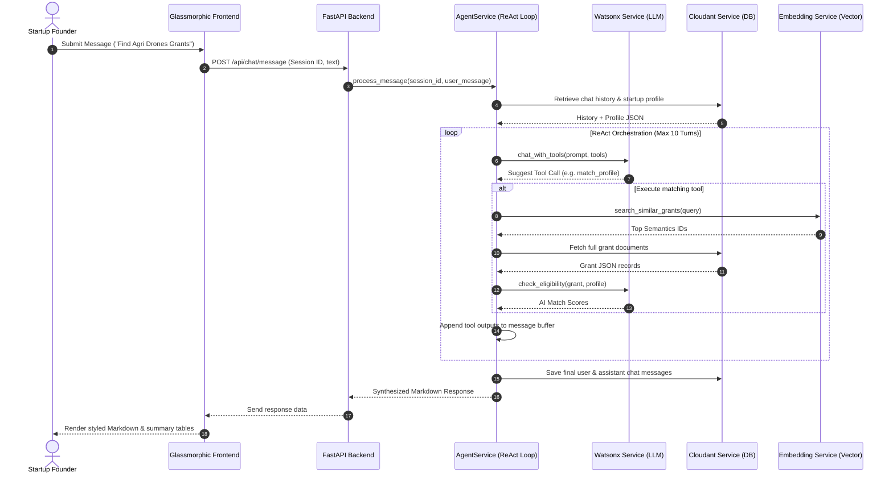
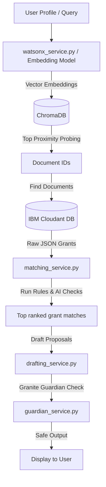
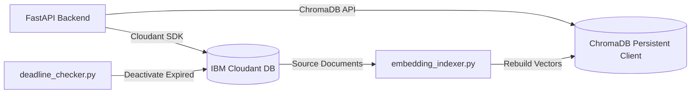

# FundBot AI: Autonomous Grant Discovery & Proposal Drafting Assistant 🚀

### Deployed Link - [FundBot]([url](https://fundbot-frontend-12.vercel.app/))

> An enterprise-grade, agentic conversational application designed to help Indian startups discover funding, automate eligibility screening, and draft compliance-ready proposals.

---

## 📖 Executive Summary

### What the Project Is
FundBot is an AI-driven, multi-agent conversational assistant designed to bridge the information gap between funding organizations (government and private) and early-stage startups.

### Why It Exists
Startup funding landscapes, especially government grants in India (e.g., Startup India, BIRAC, iDEX), are highly fragmented. Requirements are scattered across complex, multi-page PDFs, and writing compliance-ready proposals requires deep domain expertise. FundBot consolidates this process.

### Who It Is For
- **Startup Founders**: Seeking to identify grants they actually qualify for without spending hundreds of hours reading guidelines.
- **Incubators & Accelerators**: Assisting portfolios in finding and applying for capital.
- **Hackathon Judges & Recruiters**: Reviewing state-of-the-art implementations of ReAct agents, semantic vector databases, and LLM guardrails.

### What Problem It Solves
- **Information Asymmetry**: Automatically gathers, structures, and indexes grant opportunities.
- **Complex Eligibility Math**: Eliminates compliance guesswork by blending deterministic rules with semantic matching and LLM-powered legal verification.
- **Proposal Friction**: Instantly drafts grant-specific applications using Retrieval-Augmented Generation (RAG).

### Why It Is Unique
FundBot does not rely on static forms or generic keyword matches. It runs an active ReAct loop utilizing **IBM Watsonx Granite** or **Google Gemini** models to orchestrate search tools, cross-reference requirements dynamically, check safety guardrails, and adapt responses based on historical chat context.

---

## ✨ Features & Capabilities

### 1. Conversational Agentic Chat (AI Assistant)
*   **Purpose**: Enables conversational discovery, question-answering, and execution of backend tools through natural language.
*   **Implementation**: Utilizes an autonomous ReAct loop executing up to 10 reasoning turns per request.
*   **Files Involved**: `apps/api/services/agent_service.py`, `apps/api/api/chat.py`.
*   **APIs & Models**: Watsonx Granite (`ibm/granite-4-h-small`) or Gemini (`gemini-3.1-flash-lite`).
*   **Dependencies**: `google-genai`, `ibm-watsonx-ai`.

### 2. Hybrid Matching Engine
*   **Purpose**: Computes multi-dimensional compatibility scores between a startup's profile and grant requirements.
*   **Implementation**: Merges a deterministic rule validator ($30\%$), a ChromaDB semantic distance query ($30\%$), and an LLM eligibility check ($40\%$).
*   **Files Involved**: `apps/api/services/matching_service.py`, `apps/api/api/matching.py`.
*   **APIs & Models**: Granite Embedding (`ibm/granite-embedding-278m-multilingual`), Granite Chat.
*   **Dependencies**: `chromadb`, `ibm-watsonx-ai`.

### 3. Contextual Proposal Drafting (RAG)
*   **Purpose**: Drafts structured proposal text based on grant guidelines, startup parameters, and retrieved historical templates.
*   **Implementation**: RAG system retrieving top similar grants, generating JSON-structured sections, and outputting formatted Markdown.
*   **Files Involved**: `apps/api/services/drafting_service.py`, `apps/api/api/applications.py`.
*   **APIs & Models**: Granite Chat, Gemini Chat.

### 4. Safety Guardrails (Guardian)
*   **Purpose**: Validates generated text to verify legal accuracy, remove hallucinations, and check for PII exposure.
*   **Implementation**: Evaluates the compiled draft against source grant rules via special safety evaluation prompts.
*   **Files Involved**: `apps/api/services/guardian_service.py`.
*   **APIs & Models**: Granite Chat.

---

## 🏗️ Architecture Overview

The system is structured as an asynchronous Web-API architecture communicating via REST, SSE (Server-Sent Events), and WebSockets.

### Request & Response Flow


### AI Pipeline & Retrieval Flow


### Database & Storage Flow


---

## 📂 Repository Structure

```
c:/Users/akshi/PycharmProjects/AgenticSomething/
├── apps/
│   ├── api/                        # FastAPI Backend Application
│   │   ├── api/                    # HTTP Router Definitions
│   │   │   ├── admin.py
│   │   │   ├── applications.py
│   │   │   ├── chat.py
│   │   │   ├── grants.py
│   │   │   ├── matching.py
│   │   │   └── profiles.py
│   │   ├── services/               # Core Domain Business Logic
│   │   │   ├── agent_service.py
│   │   │   ├── cloudant_service.py
│   │   │   ├── drafting_service.py
│   │   │   ├── embedding_service.py
│   │   │   ├── extraction_service.py
│   │   │   ├── guardian_service.py
│   │   │   ├── matching_service.py
│   │   │   └── watsonx_service.py
│   │   ├── config.py               # Application configuration schemas
│   │   ├── dependencies.py         # Service layer DI container
│   │   └── main.py                 # Backend API entry point
│   └── frontend/                   # UI Files
│       └── index.html              # Single Page Application
├── db/
│   └── upload_to_cloudant.py.py    # Seed utility for population
├── workers/                        # Background sync and checker routines
│   ├── deadline_checker.py
│   └── embedding_indexer.py
├── shared/                         # Constants and LLM Prompts
│   └── prompts/
│       ├── drafting_prompts.py
│       ├── extraction_prompts.py
│       └── matching_prompts.py
├── tests/                          # Integration and Unit Test suite
│   ├── mocks/
│   │   ├── mock_cloudant.py
│   │   └── mock_watsonx.py
│   └── ...
├── agent_tools.py                  # Core schemas and matching functions
├── workflow.py                     # Watsonx test script
├── Dockerfile                      # Container definitions
├── docker-compose.yml              # Multi-container local build
└── requirements.txt                # Python backend dependencies
```

---

## 📄 File-by-File Documentation

### 1. `apps/api/main.py`
-   **Purpose**: Backend server instantiation and lifecycle management.
-   **Responsibilities**: Registers routers, sets up CORS rules, handles startup vectors re-indexing.
-   **Endpoints**:
    *   `GET /health`: System health assessment.
-   **Dependencies**: `fastapi`, `CORSMiddleware`, `config.py`, `dependencies.py`.
-   **Imports**: `apps.api.config`, `apps.api.dependencies`, routers (`grants`, `profiles`, `matching`, `applications`, `chat`, `admin`).
-   **Who Calls It**: `uvicorn` processes.
-   **Whom It Calls**: `dependencies.get_services()` to trigger startup indexing.
-   **Important Logic**: During `lifespan`, downloads active grants from Cloudant and indexes them in ChromaDB.
-   **Complexity**: Low.

### 2. `apps/api/config.py`
-   **Purpose**: Pydantic BaseSettings management.
-   **Responsibilities**: Defines, validates, and parses system config variables.
-   **Classes**: `Settings`.
-   **Who Calls It**: `apps/api/main.py`, `apps/api/dependencies.py`.
-   **Important Logic**: Loads environment variables from `.env` with UTF-8 encoding. Uses `@lru_cache` on `get_settings()` to avoid redundant file reads.

### 3. `apps/api/dependencies.py`
-   **Purpose**: Service dependency injection container.
-   **Responsibilities**: Creates singleton/shared services context.
-   **Classes**: `Services` dataclass.
-   **Functions**:
    *   `get_services()`: Returns active services instance. Falls back to mock service layer if `use_mock_ai` settings are enabled.
-   **Who Calls It**: FastAPI router dependencies (`Depends(get_services)`).
-   **Whom It Calls**: All services (`WatsonxService`, `CloudantService`, `EmbeddingService`, etc.).

### 4. `apps/api/api/chat.py`
-   **Purpose**: Communication endpoints (REST, WebSockets, Server-Sent Events).
-   **Responsibilities**: Creates chat sessions and streams conversation flows.
-   **Endpoints**:
    *   `POST /session`: Generates a `chat_session` record mapping a startup profile.
    *   `POST /message`: Evaluates queries synchronously.
    *   `POST /message/stream`: SSE (`text/event-stream`) streaming tool state and LLM output.
    *   `WS /ws/{session_id}`: High-performance bidirectional websocket stream.
-   **Who Calls It**: Frontend JS clients.
-   **Whom It Calls**: `AgentService` handler.

### 5. `apps/api/api/grants.py`
-   **Purpose**: Endpoint controller for grants management.
-   **Endpoints**:
    *   `GET /`: Queries grants from Cloudant by status and funding type.
    *   `GET /{grant_id}`: Retrieves details for a specific grant.
    *   `POST /search`: Structural query using `SearchGrantsInput`.
    *   `POST /semantic-search`: Semantic retrieval over ChromaDB.
    *   `GET /{grant_id}/explain`: Generates structured text explanation for a grant.

### 6. `apps/api/api/matching.py`
-   **Purpose**: Matching interface.
-   **Endpoints**:
    *   `POST /`: Finds matching grants for a startup profile using the hybrid engine.

### 7. `apps/api/api/applications.py`
-   **Purpose**: Proposal draft controller.
-   **Endpoints**:
    *   `POST /draft`: Generates proposal text and saves it as an application document.
    *   `POST /{application_id}/refine`: Refines a proposal section based on feedback.
    *   `GET /`: Lists applications matching a specific profile.

### 8. `apps/api/services/agent_service.py`
-   **Purpose**: Core agent loop orchestrator.
-   **Responsibilities**: Standard ReAct agent implementation. Manages tools execution, chat history context window, and response synthesis.
-   **Classes**: `AgentService`.
-   **Functions**:
    *   `process_message()`: Manages agent execution loop (up to 10 turns).
-   **Important Logic**: Formats tools, updates history, handles exceptions, and saves final user and assistant messages in Cloudant.

### 9. `apps/api/services/matching_service.py`
-   **Purpose**: Hybrid matching algorithm.
-   **Responsibilities**: Matches startups against active grants.
-   **Classes**: `MatchingService`, `MatchResult`.
-   **Functions**:
    *   `_rule_score()`: Deterministic checks (weight: $30\%$).
    *   `match_profile_to_grants()`: Calculates composite score by adding rule checks, vector search, and AI audits.
-   **Important Logic**: Runs rule matching and vector queries to identify top candidates, then performs detailed AI eligibility audits on the top 5.

### 10. `apps/api/services/watsonx_service.py`
-   **Purpose**: External LLM adapter.
-   **Responsibilities**: Translates messages, toggles between IBM Watsonx Granite and Google Gemini SDKs, and manages parameters.
-   **Classes**: `WatsonxService`.
-   **Functions**:
    *   `chat()`: Model inference wrapper.
    *   `chat_with_tools()`: Evaluates chat loops with tool definitions.
    *   `check_eligibility()`: Audits criteria using the matching prompt structure.

### 11. `apps/api/services/cloudant_service.py`
-   **Purpose**: IBM Cloudant database adapter.
-   **Responsibilities**: Provides high-level CRUD methods for grants, profiles, applications, and chat logs.
-   **Classes**: `CloudantService`.
-   **Functions**:
    *   `get_document()` / `create_document()` / `update_document()` / `delete_document()`
    *   `create_chat_session()` / `append_message()`

### 12. `apps/api/services/embedding_service.py`
-   **Purpose**: Local vector database manager.
-   **Responsibilities**: Indexes grants and runs semantic proximity searches.
-   **Classes**: `EmbeddingService`.
-   **Functions**:
    *   `index_grant()` / `index_all_grants()` / `semantic_search_grants()`
-   **Important Logic**: Concatentates grant attributes (name, description, stage, location, amount) into a single descriptive text for index consistency.

### 13. `apps/api/services/drafting_service.py`
-   **Purpose**: RAG proposal generator.
-   **Responsibilities**: Assembles context and generates tailored proposal documents.
-   **Classes**: `DraftingService`.
-   **Functions**:
    *   `generate_draft()` / `refine_section()`
-   **Important Logic**: Uses ChromaDB to retrieve the most similar grants to inject as contextual examples for the proposal.

### 14. `apps/api/services/guardian_service.py`
-   **Purpose**: Output validation and guardrails.
-   **Responsibilities**: Checks generated drafts for hallucinations, PII leakage, or compliance risks.
-   **Classes**: `GuardianService`.
-   **Functions**:
    *   `validate_draft()`: Runs verification prompts against Watsonx Granite.
    *   `sanitize_proposal()`: Appends human-review disclaimers.

### 15. `apps/api/services/extraction_service.py`
-   **Purpose**: Unstructured text parser.
-   **Responsibilities**: Extracts key grant parameters (e.g., name, eligibility, provider) from raw document text into JSON.
-   **Classes**: `ExtractionService`.

### 16. `workers/deadline_checker.py`
-   **Purpose**: Automated deadline maintenance.
-   **Responsibilities**: Iterates active grants, compares current dates, and marks expired opportunities as `inactive`.

### 17. `workers/embedding_indexer.py`
-   **Purpose**: Batch vector indexing worker.
-   **Responsibilities**: Reads active grants from Cloudant and regenerates ChromaDB vector embeddings.

### 18. `data/structured/data_validation.py`
-   **Purpose**: Schema validation schemas.
-   **Responsibilities**: Enforces strict Pydantic structures for documents and API inputs.
-   **Classes**: `FundingOpportunity`, `Provider`, `Eligibility`, `SearchGrantsInput`, `StartupProfile`.

### 19. `agent_tools.py`
-   **Purpose**: Shared agent utilities.
-   **Responsibilities**: Declares JSON schema tools and exposes rule-based search utilities.
-   **Functions**:
    *   `search_grants()`: Hard-coded database filter searches.

### 20. `apps/frontend/index.html`
-   **Purpose**: Web client interface.
-   **Responsibilities**: Standard single-page dashboard. Manages UI states, renders real-time Markdown, and handles REST/Websocket streams.

---

## 🔄 Execution Flow & Request Lifecycles

### 1. Application Startup Flow
When you run `uvicorn apps.api.main:app` or run python scripts:
```
[Server Start] ──► Load Environment (.env) ──► Validate Settings (config.py)
                                                      │
 ┌────────────────────────────────────────────────────┘
 ▼
Initialize Services (dependencies.py)
 ├─► Create Watsonx Service client (SDK Init)
 ├─► Authenticate Cloudant Service client
 └─► Connect to ChromaDB Persistent Client
         │
         ▼
[Startup Lifespan Triggered]
 ├─► Pull active grants from Cloudant DB
 └─► Index and save vector embeddings in ChromaDB
         │
         ▼
[API Server Ready] ──► Listen on http://localhost:8000
```

### 2. Request Lifecycle for `/api/chat/message`
```
[HTTP POST Request] ──► Validation (Check session_id & user message body)
                                   │
 ┌─────────────────────────────────┘
 ▼
Routing ──► Mount Chat Router ──► Request Depends(get_services)
                                           │
 ┌─────────────────────────────────────────┘
 ▼
Service Layer ──► Fetch Chat History & Startup Profile from Cloudant
                                   │
 ┌─────────────────────────────────┘
 ▼
Agentic Loop (ReAct)
 ├─► Compile system prompt with profile details
 ├─► Send history to Watsonx (LLM)
 ├─► LLM determines action -> Triggers Backend Tools
 ├─► Tools fetch data (Cloudant search / Chroma Proximity query)
 └─► Feed outputs back to Watsonx context
         │
         ▼
Response Generation ──► Synthesize conversation response
                                   │
 ┌─────────────────────────────────┘
 ▼
Save conversation updates to Cloudant ──► Send JSON text reply to client
```

---

## 📂 Folder Deep-Dive

### `apps/api/`
-   **Purpose**: The central core of the application server.
-   **Responsibilities**: Interfaces endpoints, services layer, and configuration parameters.
-   **Future Improvements**: Implement asynchronous database drivers, introduce structured configuration versioning, and decouple DI mechanisms.

### `apps/api/api/`
-   **Purpose**: HTTP REST/WS controller routing.
-   **Responsibilities**: Validates incoming schemas and maps requests to services.
-   **Future Improvements**: Introduce unified validation error schemas and add request rate-limiting middleware.

### `apps/api/services/`
-   **Purpose**: Business logic layer.
-   **Responsibilities**: Implements matching math, agent loops, RAG, and safety guardrails.
-   **Future Improvements**: Support multi-agent execution graphs and introduce semantic vector caching.

### `workers/`
-   **Purpose**: Offline jobs and data sync.
-   **Responsibilities**: Rebuilds Chroma DB vectors and flags expired grants.
-   **Future Improvements**: Transition to a scheduled cron setup (e.g. Celery / Redis) for distributed execution.

---

## 🧠 AI Components & Prompts

### Prompt Engineering
Prompts are isolated inside `shared/prompts/` to ensure modular updates:
-   **System Prompt**: Defined in `agent_service.py` (`AGENT_SYSTEM_PROMPT`). Instructs the agent to act as **FundBot**, enforce strict groundness, execute eligibility scoring formats, and adhere to formatting rules.
-   **Eligibility prompt**: Located in [matching_prompts.py](file:///c:/Users/akshi/PycharmProjects/AgenticSomething/shared/prompts/matching_prompts.py). Guides Watsonx Granite to review a grant and profile, outputting JSON matching metadata, met criteria, and compatibility states.
-   **Drafting prompt**: Located in [drafting_prompts.py](file:///c:/Users/akshi/PycharmProjects/AgenticSomething/shared/prompts/drafting_prompts.py). Configures the RAG system to generate compliance proposals containing an executive summary, technology solution, budget plan, and timeline.

### Model Selection
*   **Text/Chat Tasks**: IBM Watsonx `ibm/granite-4-h-small` (or Google `gemini-3.1-flash-lite` if key is active).
*   **Vector Embeddings**: IBM Watsonx `ibm/granite-embedding-278m-multilingual`.

---

## 💾 Database & Storage Architecture

### IBM Cloudant
Cloudant stores all documents inside a single database partition. Documents are structured JSON records categorized by a `type` attribute:
-   `type: "grant"`: Opportunities containing eligibility criteria arrays.
-   `type: "startup_profile"`: Startup characteristics.
-   `type: "chat_session"`: Multi-turn message arrays.
-   `type: "application"`: Generated proposal drafts linked to a profile.

### ChromaDB
A local persistent client store saving grant embeddings:
*   **Collection Name**: `grants`
*   **Vector Engine**: Cosine similarity.
*   **Payload**: The document ID is mapped to the Cloudant UUID, while the document content contains a synthesized profile overview of the grant.

---

## ⚙️ Configuration & Variables

| Variable | Description | Required | Default Value | Example |
| :--- | :--- | :--- | :--- | :--- |
| `WATSONX_API_KEY` | IBM Cloud IAM API Key for Watsonx | Yes | None | `aX9j...7L` |
| `WATSONX_PROJECT_ID` | IBM Watsonx project ID | Yes | None | `a90b8f41-...` |
| `WATSONX_URL` | Regional Watsonx service endpoint | No | `https://eu-de.ml.cloud.ibm.com` | `https://us-south.ml.cloud.ibm.com` |
| `CLOUDANT_API_KEY` | IBM Cloudant service credentials | Yes | None | `8_vP...X9` |
| `CLOUDANT_URL` | IBM Cloudant account URL | Yes | None | `https://xxx-bluemix.cloudantnosqldb.appdomain.cloud` |
| `CLOUDANT_DATABASE` | Target Cloudant database | No | `startup-funding` | `grants-db` |
| `GEMINI_API_KEY` | Google Gemini API key | No | None | `AIzaSy...` |
| `CHROMA_PERSIST_DIR` | Directory to save ChromaDB vectors | No | `./chroma_gemini` | `./vector_data` |
| `USE_MOCK_AI` | Bypasses Watsonx with mock data | No | `False` | `True` |

---

## 🔒 Security Posture
1.  **Strict Schema Validation**: Uses Pydantic to filter out payload injection attempts.
2.  **Granite Guardian Safety Check**: Proposals are scanned by a safety prompt check to flag leaks or claims.
3.  **Authentication & Sessions**: Connects chat interactions to unique, backend-generated session IDs (`profile_id` mappings) to keep conversations private.

---

## 🚀 Deployment & Infrastructure
-   **Backend**: Can be deployed to container hosting platforms (like **IBM Code Engine**, Render, or Docker).
-   **Frontend**: Hosted as static HTML/JS web files (e.g., via Vercel or Netlify).
-   **Database**: IBM Cloudant NoSQL Lite/Standard tier.

---

## 🧪 Testing & Validation

### Running Unit & Mock Tests
The system includes unit tests using mock interfaces for Watsonx and Cloudant:
```bash
# Run tests
pytest tests/
```
The test suite utilizes mocks located in `tests/mocks/` to verify agent loops and API endpoints without calling external APIs.

---

## 🔮 Future Improvements & Roadmap

### Short-Term
*   Migrate to Celery for background indexing.
*   Add PDF document upload tools for automated startup profile extraction.

### Medium-Term
*   Add multi-agent collaboration (e.g. specialized searcher, matching auditor, and drafting writer agents).
*   Add support for private database uploads.

### Long-Term
*   Support fine-tuning support on local compliance documents.
*   Integrate multi-currency exchange calculators.


# Render Deployment Guide: Containerizing FundBot AI 🌐

This guide outlines how **FundBot** is deployed to **Render** by packaging the application into a Docker image, exposing the FastAPI endpoints, and mounting the static frontend client.

---

##  The Containerization Setup

FundBot provides a multi-container deployment model utilizing a production-ready `Dockerfile` and a local orchestration setup (`docker-compose.yml`).

### 1. The Dockerfile
The backend container is built from a slim Python 3.11 base image:
*   **Base Image**: `python:3.11-slim`
*   **Exposed Port**: `8080` (dynamic port binding)
*   **Startup Command**: Runs Uvicorn dynamically binding to the host port specified by Render:
    ```bash
    uvicorn apps.api.main:app --host 0.0.0.0 --port ${PORT:-8080}
    ```

### 2. Local Docker Compose Composition
For local staging, the `docker-compose.yml` launches two parallel services:
-   `api`: Builds the root Dockerfile, forwards port `8080`, mounts the project code directory, and loads environmental keys from `.env`.
-   `frontend`: Mounts `apps/frontend/` and spins up a static Python HTTP server on port `3000` to serve the user dashboard.

---

## 🚀 Steps to Deploy on Render

Render fully supports building and running Docker-based web applications. Follow these steps to host your live application:

### Step 1: Create a Render Web Service
1.  Log in to your [Render Dashboard](https://dashboard.render.com/).
2.  Click **New +** and select **Web Service**.
3.  Connect your GitHub/GitLab repository hosting the FundBot code.

### Step 2: Configure Service Runtime Settings
Set the following options during the service creation wizard:
*   **Name**: `fundbot-api` (or custom name)
*   **Region**: Select the region closest to your target users.
*   **Branch**: `main` (or your active production branch)
*   **Runtime**: Select **Docker** (Render will automatically detect your root `Dockerfile`).
*   **Instance Type**: Choose **Free** or **Starter** depending on your performance demands.

### Step 3: Configure Environment Variables
Navigate to the **Environment** tab of your Render Web Service dashboard and insert the following secret keys:

| Environment Variable | Description | Value Source |
| :--- | :--- | :--- |
| `WATSONX_API_KEY` | IBM Watsonx IAM credential token | IBM Cloud dashboard |
| `WATSONX_PROJECT_ID` | Watsonx workspace ID | IBM Watsonx console |
| `WATSONX_URL` | Regional API endpoint | `https://eu-de.ml.cloud.ibm.com` |
| `CLOUDANT_API_KEY` | Cloudant NoSQL database API key | IBM Cloud console |
| `CLOUDANT_URL` | Cloudant service endpoint URL | IBM Cloud console |
| `CLOUDANT_DATABASE` | Target database collection name | `startup-funding` |
| `GEMINI_API_KEY` | Optional: Google Gemini validation key | Google AI Studio |

---

## ⚡ Dynamic Port Binding on Render

Render dynamically assigns a port to web services using the `$PORT` environment variable. 

FundBot's `Dockerfile` is built to capture this parameter:
```dockerfile
CMD ["sh", "-c", "uvicorn apps.api.main:app --host 0.0.0.0 --port ${PORT:-8080}"]
```
*   **Local Run**: Defaults to port `8080`.
*   **Render Run**: Overrides the port value automatically with Render's target port (e.g., `10000`), opening the API endpoint.

---

## ⚠️ Key Deployment Considerations

### 1. ChromaDB Ephemeral Storage
Since Render's free tier has an ephemeral disk (which resets upon container restart), changes saved in local vector files will be wiped if the container sleeps.
*   **Mitigation**: FundBot handles this seamlessly. On start, the backend's lifespan script pulls all active grants from Cloudant and re-indexes them into the local ChromaDB database in memory, ensuring search data is never lost.

### 2. CORS Configurations
Once deployed, make sure to update your FastAPI CORS configuration in your code to allow HTTP requests from your Render frontend origin.

